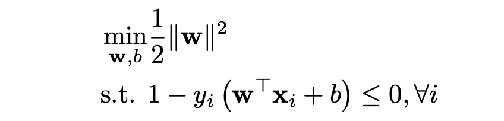

### Task description 

In this problem you are asked to write a program that construct support vector machine models with different kernel functions and slack variable.

Programming preparation Installation of sklearn package: If you want to install package for system default python, use the command

```
    pip install sklearn
```

If you want to install package for a specific version of python, say python3.6, use the command

```
    python3.6 -m pip install sklearn
```

Installation of jupyter notebook: If you want to install package for system default python, use the command

```
    pip install notebook
```

If you want to install package for a specific version of python, say python3.6, use the command

```
python3.6 -m pip install notebook
```

To use the jupyter notebook, navigate to the directory you want and run jupyter notebook. For example, the director of this homework is under the folder

```
    ~/Downloads/SVM_hw
```

Then the command would be like this

```
    cd ~/Downloads/SVM_hw
    python3 -m jupyter notebook
```

Then you can click the .ipynb file and begin your editing.

Datasets You are provided with the training and testing datatset (see train.txt and test.txt), including 120 training data and 30 testing data, respectively. It covers 3 classes, corresponding to setosa, versicolor, virginica. They are derived from the Iris dataset (https://archive.ics.uci.edu/ml/datasets/iris), contains 3 classes of 50 instances each, where each class refers to a type of iris plant. Your task is to classify each iris plant as one of the three possible types.

### What you should do

You should use the SVM function from python sklearn package, which provides different form of SVM function you can use. For multiclass SVM you should use one vs rest strategy. You are recommended to use sklearn.svm.svc() function. You can use numpy for the vector manipulation.
For technical report you should state clearly the optimization problem you are solving, how did you derive it, the meaning of different values in the formulation, and some results suitable for presenting in the report (e.g. training error, testing error). The basic form of SVM is given and you don’t need to derive this



1. Calculate using standard SVM model (linear separator). Fit your algorithm on the training dataset, then validate your algorithm on testing dataset. Compute the misclassification error of training and testing datasets, the weight vector w, the bias b, and the indices of support vectors(start with 0). Write output to file SVM linear.txt. Note that the sklearn package doesn’t provide a function with strict separation so we will simulate this using C = 1e5. You should print out the coefficient for each different class separately. The output format should be like this

```
      ${training_error}
      ${testing_error}
      ${w_of_setosa}
      ${b_of_setosa}
      ${support_vector_indices_of_setosa}
      ${w_of_versicolor}
      ${b_of_versicolor}
      ${support_vector_indices_of_versicolor}
      ${w_of_virginica}
      ${b_of_virginica}
      ${support_vector_indices_of_virginica}
```

where each line contains one variable. The training error and testing error count the total error instead of error for each distinct class, the error is ${\text{wrong prediction}}\over{\text{number of data}} $. If we view the one vs all strategy as combining the multiple number of data different SVM, each one being a separating hyperplane for one class and the rest of the points, then the $w,b$ and support vector indices for that class is the corresponding parameters for the SVM separating this class and the rest of the points. If a variable is of vector form, say α = [1,2,3]T, then you should write each entry in the same line with comma separated, e.g., 1,2,3. You should also mention in your report on which classes are linear separable with SVM without slack and how you find it out.

2. Calculate using SVM with slack variables. For each C = 0.1 × t, t = 1, 2, ..., 10, fit your algorithm on the training dataset, then validate your algorithm on testing dataset. Compute the misclassification error of training and testing datasets, the weight vector w, the bias b, the indices of support vectors, and the slack variable ξ. Write output to file SVM slack.txt. The format is

```
      ${training_error}
      ${testing_error}
      ${w_of_setosa}
      ${b_of_setosa}
      ${support_vector_indices_of_setosa}
      ${slack_variable_of_setosa}
      ${w_of_versicolor}
      ${b_of_versicolor}
      ${support_vector_indices_of_versicolor}
      ${slack_variable_of_versicolor}
      ${w_of_virginica}
      ${b_of_virginica}
      ${support_vector_indices_of_virginica}
      ${slack_variable_of_virginica}
```

3. Implement SVM with kernel functions and slack variables. You should experiment with different kernel functions in this task:

(a) A 2nd-order polynomial kernel, write output to SVM_poly2.txt

(b) A 3rd-order polynomial kernel, write output to SVM_poly3.txt

(c) Radial Basis Function kernel with σ = 1, write output to SVM_rbf.txt

(d) Sigmoidal kernel with σ = 1, write output to SVM_sigmoid.txt

During these tasks we set C = 1. The output format is

```
         ${training_error}
         ${testing_error}
         ${b_of_setosa}
         ${support_vector_indices_of_setosa}
         ${b_of_versicolor}
         ${support_vector_indices_of_versicolor}
         ${b_of_virginica}
         ${support_vector_indices_of_virginica}
```
